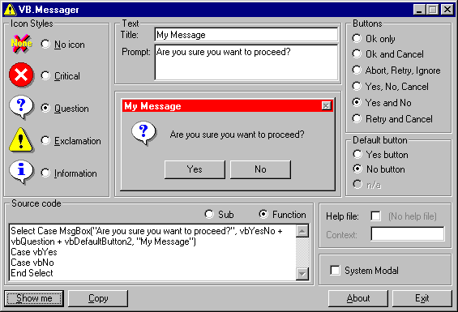

## VB\.Message: A MsgBox creator

### Description

Creating MsgBox code can be frustrating. No more. Use this simple "one screen does it all" application to create MsgBox source code. Nice interface, enough options, view the MsgBox source code straight away and a preview. Once you are happy with your design, it will copy the required code into the clipboard. Enjoy.
 
### More Info
 

             |
---                |---
**Submitted On**   |2000-04-26 10:12:04
**By**             |[Tony](https://github.com/Planet-Source-Code/PSCIndex/blob/master/ByAuthor/tony.md)
**Level**          |Intermediate
**User Rating**    |4.8 (43 globes from 9 users)
**Compatibility**  |VB 4\.0 \(32\-bit\), VB 5\.0, VB 6\.0
**Category**       |[Complete Applications](https://github.com/Planet-Source-Code/PSCIndex/blob/master/ByCategory/complete-applications__1-27.md)
**World**          |[Visual Basic](https://github.com/Planet-Source-Code/PSCIndex/blob/master/ByWorld/visual-basic.md)
**Archive File**   |[CODE\_UPLOAD52064262000\.zip](https://github.com/Planet-Source-Code/tony-vb-message-a-msgbox-creator__1-7584/archive/master.zip)

